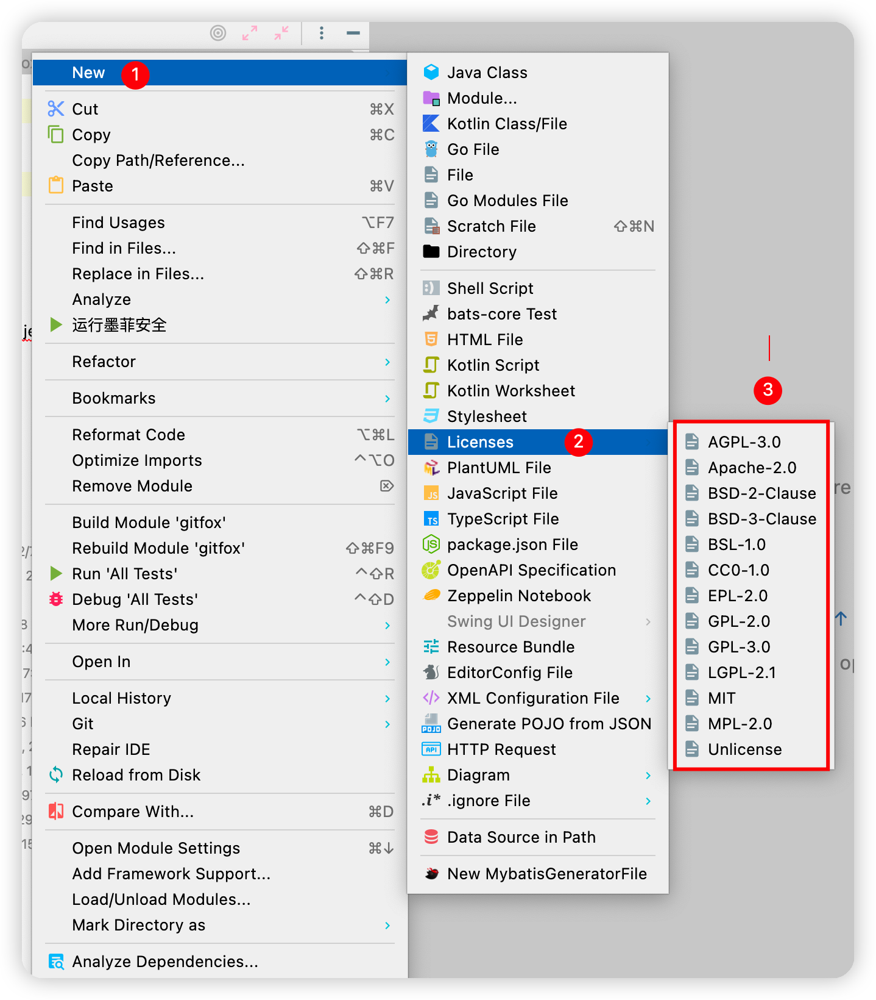

# gitfox


[](https://plugins.jetbrains.com/plugin/19448-gitfox)
[](https://plugins.jetbrains.com/plugin/19448-gitfox)

## Introduction | 简介

<!-- Plugin description -->

Gitfox is a super fox living in the git world. He has the following skills: gitcommit commit specification, open source
protocol generation.

**中文:**

Gitfox一只生活在git世界的超级狐，他具有以下技能: gitcommit提交规范、开源协议生成。

## Installation | 安装

- Using IDE built-in plugin system:

  <kbd>Settings/Preferences</kbd> > <kbd>Plugins</kbd> > <kbd>Marketplace</kbd> > <kbd>Search for "gitfox"</kbd> >
  <kbd>Install Plugin</kbd>

<!-- Plugin description end -->

## 效果演示




## 常见问题

### 1. 自定义效验规则

- 数据结构

```
{
  "code": "feat",
  "description_en": "A new feature",
  "description": "增加新功能"
},
```

- 示例 [Angular](docs/specification/angular.json)

### 如何解决网络错误问题

- 为什么会出现这个问题？

```text
因为插件最终的想法是用户可以根据自己公司的需求自定义提交规范，只要按照我定义的配置规范就行。然后提交配置，
针对这个场景如何采用本地配置配置多设备同步是个问题
按照现在的配置把你的自定义配置放到内网gitlab中，就可以把整个规范推广到全公司了。
```

- 如何解决

```text
1. 打开gitfox配置项
2. 重置远程配置文件服务
```


